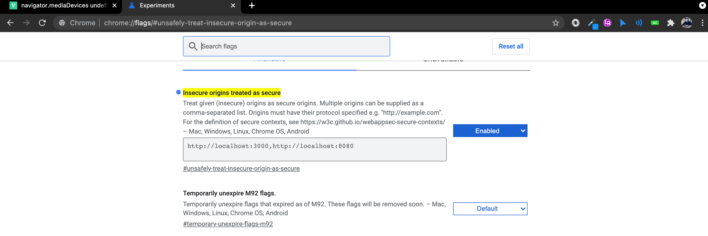
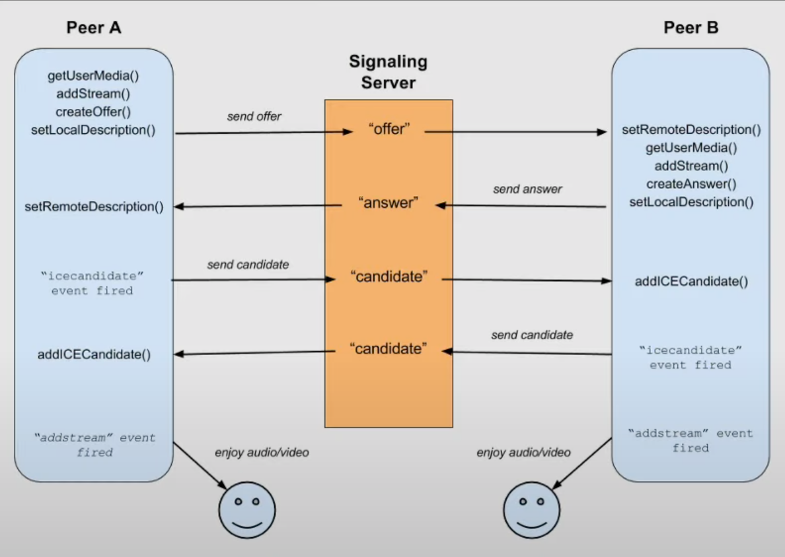

### 프로젝트 스택

#### Server

- node.js + express.js

#### Client

- pug

### 기능 구현

- 유저 식별
  - 카카오톡 로그인
  - 일반 서비스 내부 자체
- 소켓통신(채팅 및 시그널링)
- WebRTC를 통한 브라우저간 통신

### 개요

브라우저를 통해 사용자간 화상 음성 트랙을 연결하고 통신을 할수 있도록 구현합니다.

추가적으로 카카오톡 로그인을 통해 사용자 정보를 가져오는 부분까지 구현합니다.

### 로컬 실행 과정

#### 실행전 필요사항

node.js가 필요합니다. [설치 링크](https://nodejs.org/ko/download/)

#### 실행 과정

해당 레포지토리에서 clone 받으신 후

- node_modules 설치
  ```shell
  npm install
  ```
- 로컬로 서버 구동

  ```shell
  npm run dev
  ```

- 추가적으로 chrome 브라우저로 실행시, 다른 PC에서 접속 브라우저 내부적으로 http 사용시 mediaDevices를 통해 사용자 장치를 불러오지 않습니다. 즉 최신 크롬에선 안전하지 않을경우인 https가 아닐경우 mediaDevices 객체를 제공하지 않습니다.
- 그래서 테스트용으로 로컬에서 구동시 서버를 돌리는 PC가 아닌 기기에서는 아래와 같이 설정에서 허용을 해줘야 합니다.
- 
- 추가적으로 다른 기기와의 통신을 테스트하실때는 같은 공유기와 연결한상태로 사설 ip를 통해 접속하시거나 배포 이후 테스트를 진행해야 합니다.

#### 세부 설명

영상과 음성통신을 위해 소켓과 webRTC를 사용하였습니다. 소켓을 통해 브라우저간 시그널링 후 서버를 거치지 않고 webRTC를 통해 브라우저간의 통신을 이어갑니다.

테스트로 생성한 카카오톡 애플리케이션을 통해 사용자의 닉네임을 가져옵니다. 이후 일반적인 웹서비스의 회원가입 절차로 진행하면 됩니다.

추가적인 부분은 주석으로 대체합니다.

`/src/public/js/app.js`

- 프론트(클라이언트)에 적용되는 js 로직입니다.
- 카카오톡 REST API Document입니다.

`/src/server.js`

- 서버입니다. 클라이언트로부터 요청을 받고 이에 따른 소켓통신 또는 http 통신응답을 중개해줍니다.


